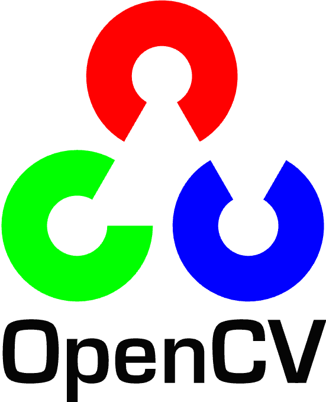

# Mobile-Robot-with-Gesture-Control-Using-ROS

## Overview
This project involves the design and implementation of a mobile robot with two wheels controlled wirelessly using ROS (Robot Operating System). The robot is designed to receive movement commands based on hand gestures captured by a laptop camera, processed using Python with the Mediapipe library. The system can also be controlled via keyboard inputs. The project combines hardware and software components to achieve a functional robotic platform, with real-time control and interaction.

We successfully implemented the system to perform four basic movements: **forward**, **backward**, **left**, and **right**. These movements are controlled wirelessly using recognized hand gestures.

## Hardware Used

  
  
   

1. **2 DC Motors**: To drive the robot's two wheels.
2. **12V Lithium Battery**: Power source for the motors and electronics.
3. **DC Motor Driver (L298N)**: Controller for the DC motors.
4. **ESP32**: Acts as the main controller and wireless communication interface using Wi-Fi.
5. **Laptop Camera**: Captures hand gestures to control the robot's movement.
6. **2 Wheels & 1 Center Wheel**: For mobility and stability.
7. **Handmade Car Structure**: Inspired by an Arduino car model, this custom-built chassis supports all the components.

## Software Used

  
  
  
  
  

1. **ROS Noetic**: The Robot Operating System (ROS) is used to handle communication between the robot, gesture control, and additional features.
2. **Arduino IDE**: Used to program the ESP32 for wireless communication and motor control.
3. **Python with Mediapipe**: Python scripts are used to process hand gestures from the camera, leveraging Mediapipe's hand-tracking capabilities.
4. **Turtlesim**: This ROS package is used both for debugging and as an additional feature, simulating the robot's movement within ROS.
5. **Teleop_Turtle**: A ROS node for keyboard control, allowing the robot to also receive movement commands via a keyboard interface.

## Study and Analysis Process

  

We started by analyzing existing mobile robotic systems, focusing on wireless control methods and hand gesture recognition technologies. Mediapipe was chosen for its robust gesture detection. The integration of ROS allowed for efficient communication between different parts of the system, such as the ESP32, the laptop camera, and the robot’s movement control. 

### Key analysis areas:
- **Wireless control**: Evaluating the most reliable methods of sending commands from a laptop to the robot.
- **Gesture recognition**: Testing different hand gestures and fine-tuning Mediapipe's capabilities.
- **Hardware integration**: Ensuring the motors, battery, and motor controller worked seamlessly with ESP32 for smooth operation.

## Implementation

  

1. **Hardware Assembly**: The robot's frame was constructed from a handmade structure inspired by an Arduino car model. The two DC motors were connected to the L298N motor driver, which in turn was controlled by the ESP32. The ESP32 was powered by a 12V lithium battery and received movement commands over Wi-Fi.
   
2. **Software Integration**: 

  

- The ESP32 was programmed using the Arduino IDE to act as a ROS node, subscribing to the `cmd_vel` topic. It interpreted the velocity commands and controlled the motors accordingly.
   - A Python script using Mediapipe was developed to recognize hand gestures from the laptop camera. Detected gestures were mapped to different movement commands, which were published to the `cmd_vel` topic in ROS.
   - ROS nodes were created for Turtlesim and Teleop_Turtle to enable both simulation and keyboard control.

3. **Communication**:

  

 
The laptop processed hand gestures and sent movement commands via Wi-Fi to the ESP32, which controlled the robot's motors. The same commands were sent to Turtlesim for debugging and additional visualization of movement.

4. **Movement Control**: The robot successfully responds to four hand gestures:
   - **Forward**: The robot moves forward.
   - **Backward**: The robot moves backward.
   - **Left**: The robot turns left.
   - **Right**: The robot turns right.

## Future Improvements
1. **Improved Gesture Recognition**: Enhance the accuracy and range of gesture recognition using advanced machine learning models or custom-trained models for specific hand gestures.
2. **Obstacle Detection**: Integrate sensors such as ultrasonic or LiDAR to enable obstacle detection and autonomous navigation.
3. **Enhanced Battery Life**: Use a more efficient power management system to extend the robot's operating time.
4. **Camera Integration on the Robot**: Mount a camera on the robot itself for real-time environment detection and advanced control mechanisms like visual SLAM.
5. **Multiple Control Modes**: Add more control modes such as voice commands or smartphone app-based control.
6. **Autonomous Navigation**: Implement SLAM (Simultaneous Localization and Mapping) and autonomous decision-making algorithms to allow the robot to navigate without human input.

---

This project successfully demonstrates the integration of gesture control and ROS in a mobile robot platform. Through future iterations and improvements, the system can be expanded into a fully autonomous or remotely operated vehicle for more complex tasks.

